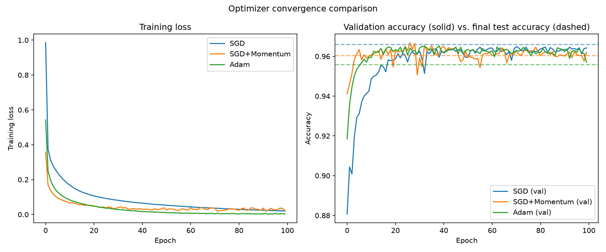

# NumPy Neural Network From Scratch

A feedforward neural network — forward pass, backpropagation, and three optimizers (SGD, SGD with momentum, Adam) — implemented from first principles using only NumPy. No PyTorch, no TensorFlow, no autograd: every gradient is derived and coded by hand, then verified numerically against finite-difference approximations.

## Why

Coursework in machine learning and optimization gives you the math. This project is the proof that the math turns into working code: every backward-pass formula below was derived by hand and checked against a numerical gradient before being trusted, not copied from a framework.

## Results

Trained a `[784, 32, 16, 10]` network (2 hidden layers, ReLU activations, softmax output) on the full MNIST dataset (70,000 28x28 handwritten digit images, 10 classes), using a 70/15/15 train/validation/test split (49,000 / ~10,500 / ~10,500 samples). Validation accuracy was monitored every epoch during training; test accuracy was computed exactly once, after every tuning decision below was finalized.

| Optimizer              | Learning rate | Final training loss | Final validation accuracy | Test accuracy (held out) |
| ---------------------- | ------------- | ------------------- | ------------------------- | ------------------------ |
| SGD                    | 0.01           | 0.0201              | 0.9642                    | **0.9661**               |
| SGD + Momentum (β=0.9) | 0.02          | 0.0235              | 0.9621                    | 0.9605                   |
| Adam                   | 0.0005        | **0.0033**          | 0.9570                    | 0.9558                   |



Left panel: training loss per epoch. Right panel: validation accuracy over training (solid lines) versus final test accuracy (dashed lines), per optimizer.

At MNIST's scale, the held-out sets are large enough (~10,500 samples) that the ~1 point gap between SGD and Adam's test accuracy is real, not sampling noise (standard error at this sample size is ~0.19 percentage points, so this gap is over 5 standard errors). But the more interesting finding is _why_: Adam's final training loss (0.0033) is roughly 6-7x lower than SGD's (0.0201), yet Adam generalizes slightly worse. This is a concrete instance of a documented phenomenon in optimization research (Wilson et al., 2017): adaptive per-parameter methods like Adam can drive training loss down more aggressively but settle into sharper regions of the loss landscape that don't hold up quite as well on unseen data, while SGD's simpler, noisier updates tend to find flatter regions that generalize slightly better. On a small, well-conditioned network like this one, the optimization difficulties that momentum and adaptive methods are designed to solve (ravines, saddle points, wildly uneven curvature) are less severe, so their extra machinery doesn't pay for itself the way it typically does on larger, deeper models.

## Method

**Architecture:** two hidden Dense layers with ReLU, softmax output layer, cross-entropy loss.

**Forward pass** (per Dense layer): $$y = xW + b$$

**Backward pass**, given the upstream gradient $\frac{\partial L}{\partial y}$:

$$\frac{\partial L}{\partial W} = x^T \frac{\partial L}{\partial y} \qquad \frac{\partial L}{\partial b} = \sum_{\text{batch}} \frac{\partial L}{\partial y} \qquad \frac{\partial L}{\partial x} = \frac{\partial L}{\partial y} W^T$$

Each of these follows directly from the multivariate chain rule: $W_{ij}$ only affects output $y_j$ and does so in proportion to input $x_i$, so its gradient is that input scaled by how much the loss cares about that output — summed across the batch, since the same weight is reused by every sample in it.

**Softmax + cross-entropy combined gradient**, where $z$ is the pre-softmax logits and $\hat{y}$ is the softmax output:
$$\frac{\partial L}{\partial z} = \hat{y} - y$$

The softmax and cross-entropy Jacobians cancel algebraically, collapsing what looks like it should require two chained Jacobians into a single subtraction.

**Numerical gradient checking:** before trusting any of the above, every layer's analytical gradient was compared against a finite-difference approximation (`gradient_check.py`):
 
$$\frac{\partial L}{\partial \theta} \approx \frac{L(\theta + \epsilon) - L(\theta - \epsilon)}{2\epsilon}$$
 
with agreement to within $10^{-9}$ relative error. This is what actually validates the backward pass — a network that trains "well enough" isn't proof the math is right; gradient checking is.

**Optimizers**, all sharing the same `step(params_and_grads)` interface:
 
$$\text{SGD:} \quad w \leftarrow w - \eta \nabla_w L$$
 
$$\text{SGD + Momentum:} \quad v \leftarrow \beta v + \nabla_w L, \qquad w \leftarrow w - \eta v$$
 
$$\text{Adam:} \quad m \leftarrow \beta_1 m + (1-\beta_1)\nabla_w L, \qquad v \leftarrow \beta_2 v + (1-\beta_2)(\nabla_w L)^2$$
 
$$\hat{m} = \frac{m}{1-\beta_1^t}, \qquad \hat{v} = \frac{v}{1-\beta_2^t}, \qquad w \leftarrow w - \eta \frac{\hat{m}}{\sqrt{\hat{v}} + \epsilon}$$
 
where $\eta$ is the learning rate, $\beta$ (or $\beta_1$, $\beta_2$) are the momentum/decay coefficients, and $t$ is the timestep used for Adam's bias correction.

## Data

Two dataset options, both handled by `data.py`:

- **`digits`** (default for quick iteration) — sklearn's built-in 8x8 images, ~1,800 samples total, no download, trains in seconds. Useful while still debugging the from-scratch implementation, but its ~270-sample validation/test splits are small enough that optimizer comparisons are dominated by sampling noise (standard error ~1.1 percentage points).
- **`mnist`** (used for the results above) — the real 28x28 MNIST, 70,000 samples, fetched once via `sklearn.datasets.fetch_openml` (cached locally after). Needs internet access on first run. Held-out sets are ~35x bigger, making optimizer comparisons far more statistically trustworthy (standard error ~0.19 percentage points).

Both go through the same three-way split:

- **Train** — fits the weights.
- **Validation** — watched every epoch, used to compare optimizers and pick hyperparameters (all three optimizers' learning rates above were tuned against this split, never the test set).
- **Test** — touched exactly once, after all tuning was finalized, for the accuracy numbers reported above.

Watching a set's accuracy to make tuning decisions and then reporting that same set's accuracy as your final result is a subtle form of overfitting through your own choices, even though the model itself never trained on that data. Keeping a genuinely untouched test set avoids that.

## Project structure

```
├── activations.py        # ReLU, sigmoid, softmax + derivatives
├── losses.py             # cross-entropy loss + combined softmax gradient
├── layers.py             # Dense layer forward/backward
├── network.py            # wires layers into a full forward/backward pass
├── optimizers.py         # SGD, SGD+Momentum, Adam
├── gradient_check.py     # numerical gradient verification
├── test_layer_shapes.py  # quick shape sanity checks for Dense layer
├── data.py               # loads and splits digits or mnist
└── train.py              # training loop, convergence plot, evaluation
```

## Setup and usage

```bash
python -m venv venv
source venv/bin/activate
pip install -r requirements.txt

python test_layer_shapes.py   # quick shape sanity check
python gradient_check.py      # verify backward pass numerically
python lr_sweep.py            # find a stable SGD+Momentum learning rate (needed per-dataset)
python adam_lr_sweep.py       # find a well-tuned Adam learning rate
python train.py               # train all three optimizers, produce results above
```
